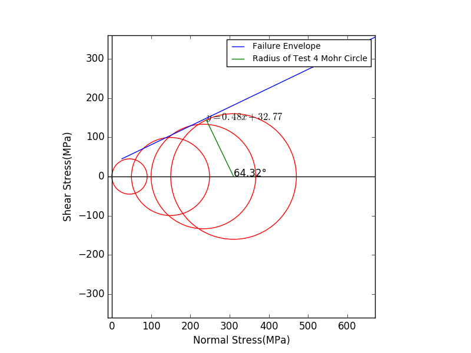

# Mohr_Envelope
Visualize Mohr Circle and Failure Envelope 
for Python 3.5.2

Why I made this code?
-------------
I had to write Geological Engineering Lab report about triaxial test, and this report requires drawing mohr circle and failure envelope. first one is an easy job, but next one isn't. we can do many things by Excel, but drawing common tangent line of mohr circles isn't in the thing. the choice was only two : First, Use Matlab. Second. Draw by hand. however, i didn't want to write report by hand and i didn't have matlab.

Therefore, I used numpy and scipy and matplotlib and these worked fine. maybe my juniors would encounter this problem. so i wrote this code to help my juniors.

As you can see, my major isn't Computer Science, so code would look like spagetti. but it works!

How it works?
-------------
If you don't know about Mohr's Circle, [read this][mohr]
[mohr]:https://en.wikipedia.org/wiki/Mohr's_circle
1. Draw Mohr circles in various σ1(major principle stress) and σ3(minor principle stress) condition. and determine point which meets circle's tangent line on each mohr circles. these point is determined by (x1-rcos(a),rsin(a)).
2. Use these point and Least-Square Method, make "Failure envelope candidate" Line. 
3. Calculate averages of differents between distance from circle's center to "Failure envelope candidate"  and circle's radius.
4. increase a(a: angle, 1~90) and repeat. Failure envelope candidate at angle a which have lowest averages of different is real failure envelope.
5. Draw Mohr circles and failure envelope.

How to use
-------------
Prior to the beginning, You have to install [numpy], [scipy], [matplotlib]
[numpy]:http://www.numpy.org/
[scipy]:https://www.scipy.org/
[matplotlib]:http://matplotlib.org/

In command prompt or shell..., Type : python mohr.py filename.csv

Input
-------------
csv file format:
>doesn't matter,σ3,σ1

If you're using excel, write anything in column A, σ3 in column B, and σ1 in column C.

Output
-------------
in Output.txt:
 >Internal Friction Angle : 00.00°  
 >Cohesion : 00.00 MPa  
 >Failure Envelope equation : y=00.00x+00.00 

in Fig.png: 

